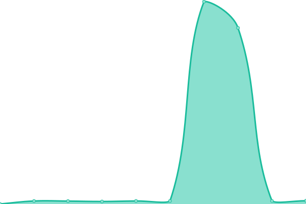

# Musonet Cloud Status

Live status page: **[musosys.github.io/status](https://musosys.github.io/status/)**

<!--start: status pages-->
<!-- This summary is generated by Upptime (https://github.com/upptime/upptime) -->
<!-- Do not edit this manually, your changes will be overwritten -->
<!-- prettier-ignore -->
| URL | Status | History | Response Time | Uptime |
| --- | ------ | ------- | ------------- | ------ |
|  [Musonet Cloud Main Site](https://musonet.cloud) | 🟩 Up | [musonet-cloud-main-site.yml](https://github.com/musosys/status/commits/HEAD/history/musonet-cloud-main-site.yml) | 

 348ms
     
 | 

<a href="https://musosys.github.io/status/history/musonet-cloud-main-site">100.00%</a>
    

|  [Infra Cluster 01](https://infra.musosys.com) | 🟩 Up | [infra-cluster-01.yml](https://github.com/musosys/status/commits/HEAD/history/infra-cluster-01.yml) | 

 397ms
     
 | 

<a href="https://musosys.github.io/status/history/infra-cluster-01">100.00%</a>
    

<!--end: status pages-->

Powered by [Upptime](https://github.com/upptime/upptime) — uptime monitoring via GitHub Actions, Issues, and Pages.
